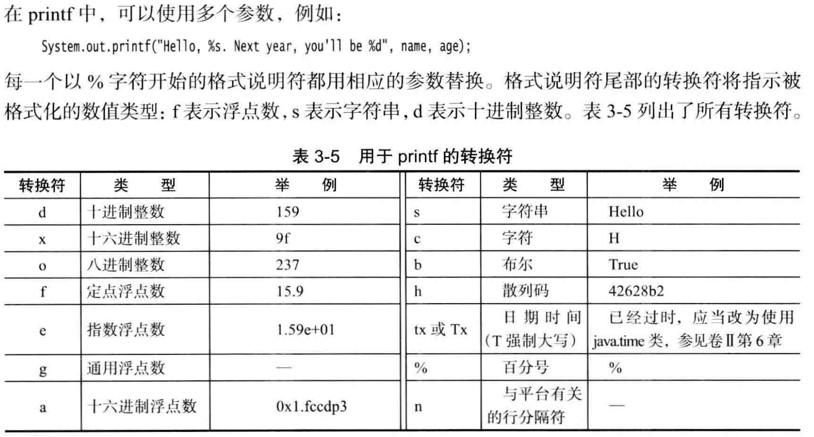
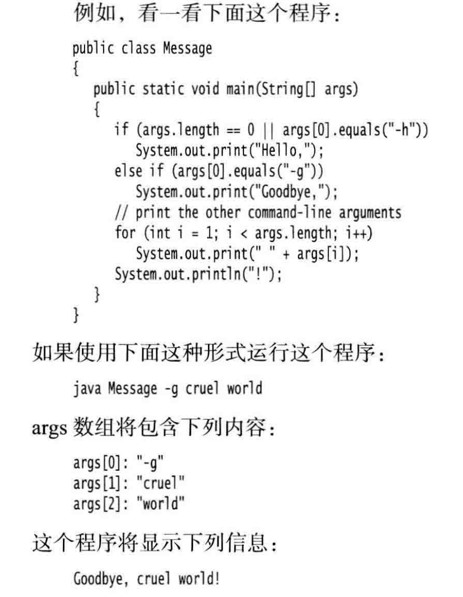

变量一定要显式初始化

常量声明用final，一般常量全大写。

变量名一定字母开头且不能有空格。

类常量在main外面，整个类内的函数都能用。

强制类型转换的语法格式是

在圆括号中给出想要转换的目标类型，后面紧跟待转换的变量名。

Math.rount(double)

Math.pow(double,double)

数据类型(这个之前没注意一共有8种类型，4种整型，2种浮点类型，1种Unicode编码的字符单元的字符类型char,
一种是表示真假的Boolean)转换是优先级是double>float>long>int

如果运算符得到一个值，其类型与左侧操作数的类型不同，就会发生强制类型转换。例如，如果x是一个int，则以下的语句
`x += 3.5;`
是合法的,将把x设置为`(int)(x + 3.5)`

因为+=是右结合运算符，所以表达式`a+=b+=c`等价于`a+=（b+=c）`

切子串包左不包右，
```
String greeting = "Hello";
String s = greeting.substring(1,3) ;
```
这种切割语法的好处是可以迅速知道去了几个字符直接就是`String.substring(a,b)`b-a个字符

检测字符串是否相等用的是equals
可以是字符串变量也可以是字符串字面量
"Hello".equals(greeting)
要想检测两个字符串是否相等，而不区分大小写， 可以使用equalsIgnoreCase 方法。
一定不要使用=运算符检测两个字符串是否相等！ 这个运算符只能够确定两个字串是否放置在同一个位置上。
空串是一个java对象，有自己的串长度（0）和内容（空）
```
if (str.length() == 0)

if (str.equals(""))
```
字符串变量还可以存放一个特殊的值，名为null，检查一个字符串是否为null，`if (str == null)`

`str.compareTo("str1")`
//如果第一个字符和参数的第一个字符不等，结束比较，返回第一个字符的ASCII码差值。
// 如果第一个字符和参数的第一个字符相等，则以第二个字符和参数的第二个字符做比较，以此类推，直至不等为止，
返回该字符的ASCII码差值。如果两个字符串不一样长，可对应字符又完全一样，则返回两个字符串的长度差值。

`int indexOf (String str, int fromlndex)`
最终返回的int和fromindex没关系都是从头开始计算的，只不过用fromindex可以少查一些点。



for-each循环要会用，这是JAVA特意增加的功能。编程效率比较高，不用下标
`for (variable : collection) statement`
```java
for (int element : a)
System.out.println(element) :
```

数组复制
一是两个变量指向一个数组
```java
int[] luckyNumbers = smallPrimes;
luckyNumbers[S] = 12; // now smallPrimes[5] is also 12
```

二是两个变量两个数组，复制地址内容
```java
int[] copiedLuckyNumbers = Arrays.copyOf(luckyNumbers, luckyNumbers.length);
```
用Array.copyof方法，第二个参数是新数组的长度。比原数组长就补零，短就截取原数组前几位。

命令行参数，每一个Java 应用程序都有一个带String arg[]参数的main 方法。
这个参数表明main 方法将接收一个字符串数组， 也就是命令行参数。

在Java 应用程序的main 方法中， 程序名并没有存储在args 数组中
例如, 当使用下列命令运行程序时
java Message -h world
args[0] 是“ -h”， 而不是“ Message” 或“ java”。

对象与类
Object-oriented programming (OOP)
类与类之间的关系
依赖(uses-a)
聚合(has-a)
继承(is-a)
